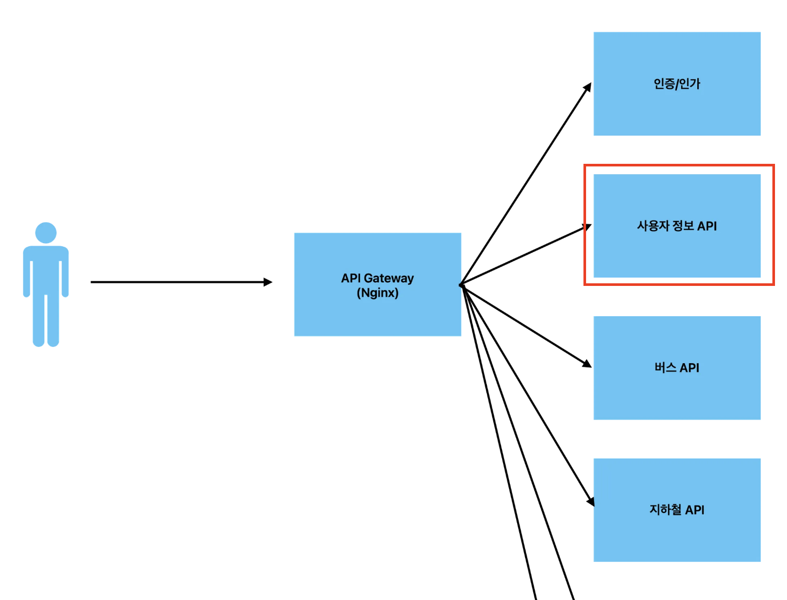

# 유저정보 API 서버
닉네임 수정, 계정 탈퇴 등의 유저정보 API 서버

## 환경
- Node (20.17.0)
- npm (10.8.1)
- Typescript (5.5.4)
- NestJS (10.4.5)
- Mysql (docker image tag 8.0)

## 구조
https://www.notion.so/100da4d72eb38007aebacdcb6ee90a28
